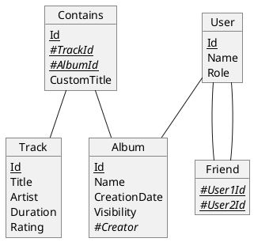
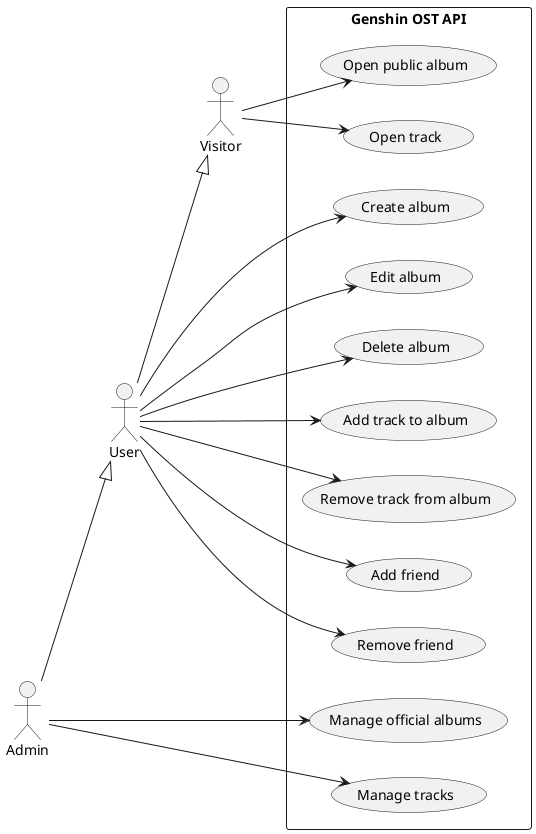

# Database

# UseCase

## Details :

### Album Visibility :

- Official (admin only) : Everyone can open the album
- Public : Logged users can open the album
- Private : Friends can open the album
- Closed : Only the owner can open the album
